# Despliegue-de-CMS-en-arquitectura-en-3-capas
En este proyecto verás como configurar un CMS como es Wordpress en 3 capas en AWS (Amazon Web Services), que verás mas adelante.

## Capas
- Capa 1: Capa pública. Balanceador de carga.
- Capa 2: Capa privada. Servidores de Backend + NFS.
- Capa 3: Capa privada. Servidor de BBDD.
## Índice

1. [Definición de AWS](#id1)
2. [Servicios utilizados](#id2)
3. [VPC](#id3)
4. [Subredes](#id4)
5. [Grupos de Seguridad](#id5)
6. [Tablas de enrutamiento](#id6)
7. [IGW, NAT y Dirección elástica](#id7)
8. [Dominio](#id8)
9. [Instancias](#id9)
10. [Scripts](#id10)


### ¿Qué es AWS? <a name="id1"></a>
AWS es una plataforma integral de servicios en la nube que ofrece cómputo, almacenamiento, bases de datos y otras herramientas para construir y ejecutar aplicaciones sin necesidad de invertir en infraestructura física

### Servicios utilizados<a name="id2"></a>
En esta práctica se ha utilizado el Servicio:
- VPC (Red, Subredes, Grupos de Seguridad, ACL, tablas de enrutamiento, Puertas de enlace de internet, IP elástica y Gateway NAT).
- EC2 (Para las instancias)

### VPC<a name="id3"></a>
En AWS es tu red virtual privada y aislada dentro de la nube de AWS.
La VPC tiene asignada la Red 10.0.0.0/16
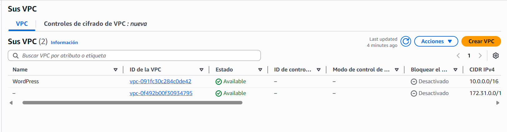

### Subredes<a name="id4"></a>
Es un rango de direcciones IP dentro de tu VPC (Virtual Private Cloud) que se utiliza para lanzar recursos como instancias EC2, bases de datos, etc., y que reside dentro de una sola zona de disponibilidad.
Para esta practica se han creado 3 subredes:
- Subred pública para el Balanceador: 10.0.2.0/24
- Subred privada para los servidores de Backend y servidor NFS: 10.0.3.0/24
- Subred privada para el servidor de Base de Datos: 10.0.4.0/24
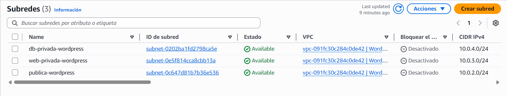

### Grupos de Seguridad<a name="id5"></a>
Un grupo de seguridad en AWS es un firewall virtual que controla el tráfico de red entrante y saliente de tus recursos.
En todas las reglas de entrada se le asigna SSH para poder conectarse remotamente a las instancias

- Grupo del Balanceador (Pública).
  Aqui se detallan las reglas de entrada / salida que se van a permitir o denegar, en este caso en reglas de salida se queda por defecto.
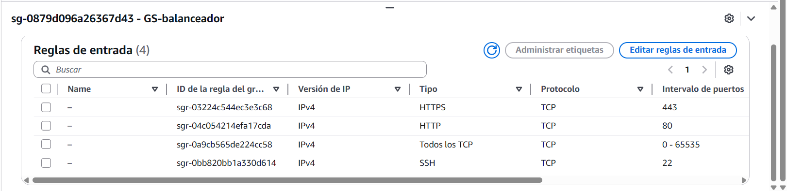
- Grupo de servidores webs (Privada).
    Aqui se detallan las reglas de entrada / salida que se van a permitir o denegar, en este caso en reglas de salida se queda por defecto.
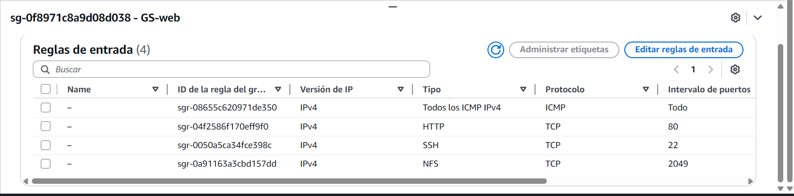
- Grupo de servidor NFS (Privada).
  Aqui se detallan las reglas de entrada / salida que se van a permitir o denegar, en este caso en reglas de salida se queda por defecto.

- Grupo de servidor de Base de Datos (Privada).
  Aqui se detallan las reglas de entrada / salida que se van a permitir o denegar, en este caso en reglas de salida se queda por defecto.
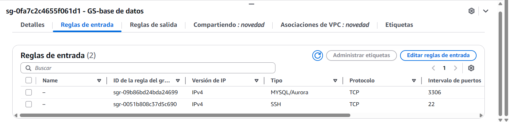

### Tablas de enrutamiento<a name="id6"></a>
Dictan a dónde se envían los paquetes de red desde tus subredes, permitiendo la comunicación entre ellas, hacia Internet, o a redes remotas, usando destinos como puertas de enlace (IGW, VGW) o interfaces de red
Hay 3 tablas de enrutamiento, una para cada subred.
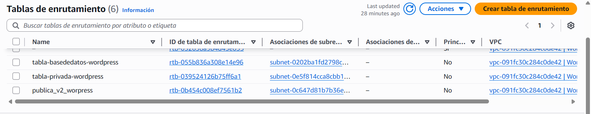
- Tabla Pública.
  Se le asigna una puerta de enlace de internet (IGW) para poder conectarse remotamente.
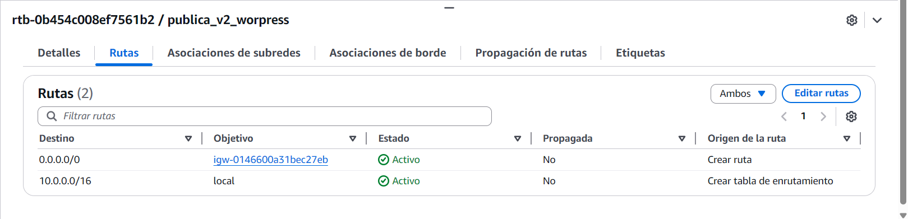
- Tabla Privada WEB y NFS. 
  Se le asigna una gateway NAT para que las instancias tengan acceso a internet, despues de instalar todo se le quitan para que esten mas seguros
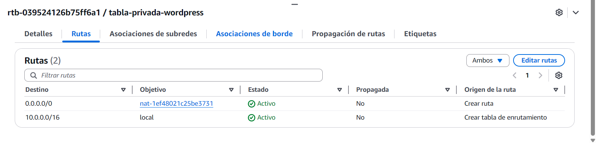
- Tabla Pribada BASE DE DATOS.
  Se le asigna una gateway NAT para que las instancias tengan acceso a internet, despues de instalar todo se le quitan para que esten mas seguros
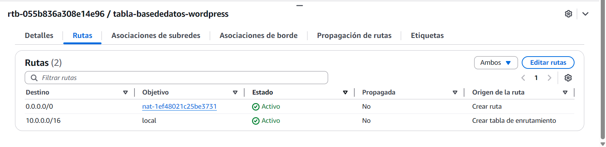

### IGW, NAT y Dirección elástica<a name="id7"></a>
#### IGW
Es un componente de tu Virtual Private Cloud (VPC) que permite la comunicación bidireccional entre tus recursos (como instancias EC2) en subredes públicas y el internet, y se asocia a la VPC creada anteriormente.
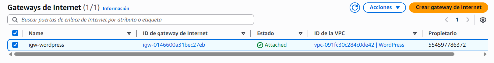
#### NAT
Son servicios administrados que permiten a las instancias en subredes privadas de tu VPC conectarse a Internet (para actualizaciones, llamadas a APIs)

#### Direcion Elástica
Las direcciones IP elásticas son direcciones IPv4 estáticas diseñadas para la informática en la nube dinámica.
En este caso se le asigna a la instancia del balanceador.
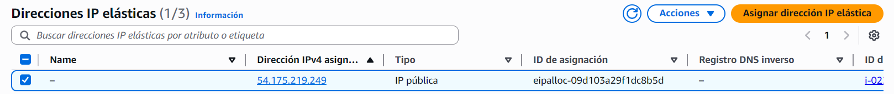
#### Dominio<a name="id8"></a>
Se crea un dominio, en este caso en NO-IP y le asignamos la ip elastica que nos ha dado AWS


### Instancias<a name="id9"></a>
Una instancia en AWS es un servidor virtual (una máquina virtual) en la nube que proporciona recursos informáticos como CPU, memoria, almacenamiento y red bajo demanda.

- Instancias creadas:
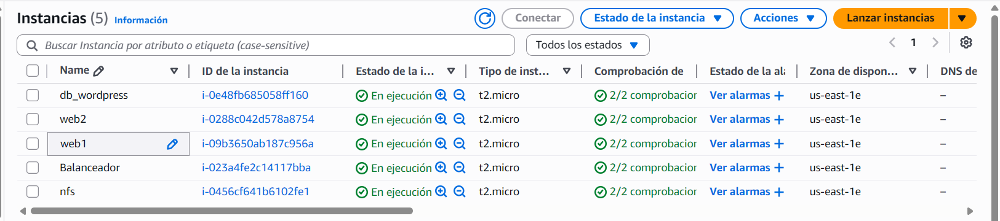

- Para esta práctica se han de crear 5 instancias:
  - Balanceador
  - Web1
  - Web2
  - NFS
  - Base de Datos
- En cada una se le asigna el la VPC, Subred, grupo de seguridad que se has creado anteriormente.


### Scripts <a name="id10"></a>

El orden de ejecutar los scripts es:
  1. DB
  2. Balanceador
  3. NFS
  4. WEBS

###### Balanceador
```bash
#!/bin/bash


# Cambiar nombre de la máquina
sudo hostnamectl set-hostname BalanceadorManuelSoltero

# Instalar Apache y modulos para balancear
sudo apt update
sudo apt install -y apache2 certbot python3-certbot-apache
sudo a2enmod proxy proxy_http proxy_balancer lbmethod_byrequests proxy_connect ssl headers

# Reiniciar Apache
sudo systemctl restart apache2

# Crear VirtualHost HTTP → HTTPS
sudo tee /etc/apache2/sites-available/load-balancer.conf > /dev/null <<EOF
<VirtualHost *:80>
    ServerName msolterod02.hopto.org
    ServerAdmin webmaster@localhost

    # Redirección permanente HTTP → HTTPS
    Redirect permanent / https://msolterod02.hopto.org

    ErrorLog \${APACHE_LOG_DIR}/error.log
    CustomLog \${APACHE_LOG_DIR}/access.log combined
</VirtualHost>
EOF

# Crear el fichero del balanceador con las ip de los webs
sudo tee /etc/apache2/sites-available/load-balancer-ssl.conf > /dev/null <<EOF
<IfModule mod_ssl.c>
<VirtualHost *:443>
    ServerAdmin webmaster@localhost
    ServerName msolterod02.hopto.org

    SSLEngine On
    SSLCertificateFile /etc/letsencrypt/live/msolterod02.hopto.org/fullchain.pem
    SSLCertificateKeyFile /etc/letsencrypt/live/msolterod02.hopto.org/privkey.pem
    Include /etc/letsencrypt/options-ssl-apache.conf

    <Proxy "balancer://mycluster">
        ProxySet lbmethod=byrequests

        # Servidor Web 1
        BalancerMember http://10.0.3.79:80

        # Servidor Web 2
        BalancerMember http://10.0.3.145:80
    </Proxy>

    ProxyPass "/" "balancer://mycluster/"
    ProxyPassReverse "/" "balancer://mycluster/"

    ErrorLog \${APACHE_LOG_DIR}/ssl_error.log
    CustomLog \${APACHE_LOG_DIR}/ssl_access.log combined
</VirtualHost>
</IfModule>
EOF

# Deshabilitar sitio por defecto y habilitar el sitio del balanceador
sudo a2dissite 000-default.conf || true
sudo a2ensite load-balancer.conf
sudo a2ensite load-balancer-ssl.conf

# Reiniciar Apache
sudo systemctl restart apache2

# --- CREAR CERTIFICADO SSL ---
# Solicitar certificado automático con Certbot
sudo certbot --apache -d msolterod02.hopto.org --non-interactive --agree-tos -m manuelsolterodiaz2006@gmail.com

# Validar configuración
apache2ctl configtest
sudo systemctl status apache2 --no-pager
```
###### Webs
```bash
#!/bin/bash
# Cambiar nombre de la máquina
sudo hostnamectl set-hostname WEB2ManuelSoltero

#Instalamos el nfs-common y modulos de php para que puedan leer el wordpress
sudo apt update
sudo apt install nfs-common apache2 php libapache2-mod-php php-mysql php-curl php-gd php-xml php-mbstring php-xmlrpc php-zip php-soap php-intl -y

#Creamos la carpeta de montaje
sudo mkdir -p /nfs/general

#Montamos la carpeta 
sudo mount 10.0.3.100:/var/nfs/general /nfs/general
echo "10.0.3.100:/var/nfs/general  /nfs/general  nfs _netdev,auto,nofail,noatime,nolock,intr,tcp,actimeo=1800 0 0" | sudo tee -a /etc/fstab
sudo cp /etc/apache2/sites-available/000-default.conf /etc/apache2/sites-available/wordpress.conf

# Configuracion para servir el contenido desde NFS
sudo tee /etc/apache2/sites-available/wordpress.conf > /dev/null <<EOF
<VirtualHost *:80>
    ServerName msolterod02.hopto.org
    ServerAdmin webmaster@localhost
    DocumentRoot /nfs/general/wordpress/
    
    <Directory /nfs/general/wordpress>
        Options +FollowSymlinks
        AllowOverride All
        Require all granted
    </Directory>
    
    ErrorLog \${APACHE_LOG_DIR}/error.log
    CustomLog \${APACHE_LOG_DIR}/access.log combined
</VirtualHost>
EOF

#Deshabilitamos el que esta por defecto y reiniciamos el apache
sudo a2dissite 000-default.conf
sudo /usr/sbin/a2ensite wordpress.conf
sudo systemctl reload apache2
```
###### NFS
```bash
#!/bin/bash
# Cambiar nombre de la máquina
sudo hostnamectl set-hostname NFSManuelSoltero

#Instalamos el servidor NFS
sudo apt update
sudo apt install nfs-kernel-server -y

#Creamos la carpeta que se va a compartir y van a poder acceder los servidores webs
sudo mkdir -p /var/nfs/general
sudo chown nobody:nogroup /var/nfs/general

#Añadimos a los servidores web 
echo "/var/nfs/general 10.0.3.79(rw,sync,no_subtree_check)" | sudo tee -a /etc/exports
echo "/var/nfs/general 10.0.3.145(rw,sync,no_subtree_check)" | sudo tee -a /etc/exports

#Descargamos wordpress y los descomprimimos en la carpeta creada anteriormente
sudo apt install unzip -y
sudo wget -O /var/nfs/general/latest.zip https://wordpress.org/latest.zip
sudo unzip /var/nfs/general/latest.zip -d /var/nfs/general/

#Asignamos los permisos y el usuario y reiniciamos el servicio 
sudo chown -R www-data:www-data /var/nfs/general/wordpress
sudo find /var/nfs/general/wordpress/ -type d -exec chmod 755 {} \;
sudo find /var/nfs/general/wordpress/ -type f -exec chmod 644 {} \;
sudo systemctl restart nfs-kernel-server
sudo exportfs -a
```
###### Base de Datos
```bash
#!/bin/bash


# Cambiar nombre de la máquina
sudo hostnamectl set-hostname DBManuelsoltero

# Instalar MariaDB-Server
sudo apt update
sudo apt install mariadb-server -y

# Crear Base de datos y usuario
sudo mysql <<EOF
CREATE DATABASE IF NOT EXISTS wordpressMSD DEFAULT CHARACTER SET utf8 COLLATE utf8_unicode_ci;

CREATE USER IF NOT EXISTS 'manuelsoltero'@'10.0.3.79' IDENTIFIED BY 'abcd';
GRANT ALL PRIVILEGES ON wordpressMSD.* TO 'manuelsoltero'@'10.0.3.79';

CREATE USER IF NOT EXISTS 'manuelsoltero'@'10.0.3.145' IDENTIFIED BY 'abcd';
GRANT ALL PRIVILEGES ON wordpressMSD.* TO 'manuelsoltero'@'10.0.3.145';

FLUSH PRIVILEGES;
EOF

# Configurar bind-address en MariaDB
sudo sed -i 's/^bind-address.*/bind-address = 0.0.0.0/' /etc/mysql/mariadb.conf.d/50-server.cnf

# Reiniciar MariaDB y ver el estado para comprobar que todo esta correcto
sudo systemctl restart mariadb
sudo systemctl status mariadb --no-pager
```
